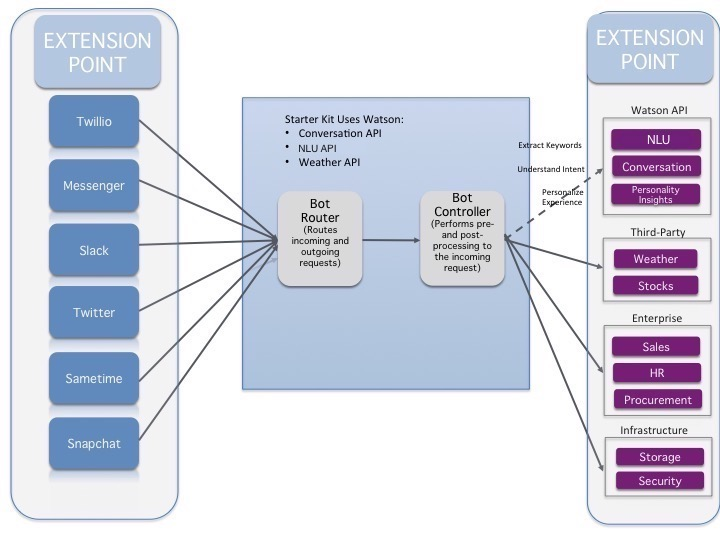

# Text Bot [](https://travis-ci.org/watson-developer-cloud/text-bot)


<p align="center">
  
</p>

## Installation

This is a Starter Kit (SK), which is designed to get you up and running quickly with a common industry pattern, and to provide information and best practices around Watson services and bots. This application demonstrates how the Conversation service can be used with different bot kits such as those from Facebook and Twilio to enable users to have an intuitive and natural conversation with the bots. This use case for this starter kit is around discussing the weather. The starter kit uses the WeatherInsights service to gather weather data and provide forecasts.

A running instance of the application in this Starter Kit is available as a [demo](https://text-bot.mybluemix.net). The demo does not include Facebook or Twilio integration. Running the application using the Facebook and Twilio bots requires credentials to access their services. For information about obtaining credentials and integrating Twilio and Facebook bots, see [Installing the bots](#bot-installation).

## Table of Contents
 - [Getting Started](#getting-started)
   - [Installing the bots](#bot-installation)
   - [Debugging the application](#debugging)
 - [About the Weather conversation pattern](#about-the-weather-conversation-pattern)
 - [Adapting/Extending the Starter Kit](#adaptingextending-the-starter-kit)
 - [Best Practices](#best-practices)
 - [Troubleshooting](#troubleshooting)

## Getting Started

### Creating a [IBM Bluemix][bluemix] Account

1. Go to https://bluemix.net/
2. Create a Bluemix account if required.
3. Log in with your IBM ID (the ID used to create your Bluemix account)


**Note:** The confirmation email from Bluemix mail take up to 1 hour.

### Deploy this sample application in Bluemix

1. Clone the repository into your computer and navigate to the new directory

   ```none
   git clone https://github.com/watson-developer-cloud/text-bot.git
   cd text-bot
   ```

1. [Sign up][sign_up] in Bluemix or use an existing account.
1. If it is not already installed on your system, download and install the [Cloud-foundry CLI][cloud_foundry] tool.
1. Edit the `manifest.yml` file in the folder that contains your code and replace `text-bot` with a unique name for your application. The name that you specify determines the application's URL, such as `your-application-name.mybluemix.net`. The relevant portion of the `manifest.yml` file looks like the following:

    ```yml
    declared-services:
    conversation-service:
      label: conversation
      plan: free
    weatherinsights-service:
      label: weatherinsights
      plan: Free-v2
    cloudantNoSQLDB-service:
      label: cloudantNoSQLDB
      plan: Lite
    applications:
      - services:
        - conversation-service
        - weatherinsights-service
        - cloudantNoSQLDB-service
      name: text-bot
      command: npm start
      path: .
      memory: 512M
    ```

1. Connect to Bluemix by running the following commands in a terminal window:

  ```none
  cf api https://api.ng.bluemix.net
  cf login
  ```

1. Create and retrieve service keys to access the [Conversation](http://www.ibm.com/watson/developercloud/doc/conversation/) service by running the following command:

  ```none
  cf create-service conversation free conversation-service
  cf create-service-key conversation-service myKey
  cf service-key conversation-service myKey
  ```

1. Create and retrieve an API key to access the [Alchemy Language](http://www.ibm.com/watson/developercloud/alchemy-language.html) service (if you already have instance skip this step) by running the following command:

  ```none
  cf create-service alchemy_api free alchemy-language-service
  cf create-service-key alchemy-language-service myKey
  cf service-key alchemy-language-service myKey
  ```

1. Create and retrieve service keys to access the [Weather Insights service](https://console.ng.bluemix.net/docs/services/InsightsWeather/index.html) by running the following command:

  ```none
  cf create-service weatherinsights Free-v2 weatherinsights-service
  cf create-service-key weatherinsights-service myKey
  cf service-key weatherinsights-service myKey
  ```

1. Create an instance of the [Cloudant NoSQL database](https://cloudant.com/) service by running the following command:

  ```none
  cf create-service cloudantNoSQLDB Lite cloudantNoSQLDB-service
  cf create-service-key cloudantNoSQLDB-service myKey
  cf service-key cloudantNoSQLDB-service myKey
  ```

1. The Conversation service must be trained before you can successfully use this application.
   The training data is provided in the file `resources/conversation-training-data.json`.
   To train the model used by the Conversation service, do the following:

    1. Login to Bluemix

    2. Navigate to upper left hand side and click on the 3 parallel lines and select **Dashboard** from the left hand navigation panel.

    3. Scroll down and under "All Services" - select the instance of the Conversation service that you are using

    4. Once on the Service details page, scroll down (if necessary) and click green **Launch tool** button on the right hand side of the page. (You may be asked to log in again. or you may see a blank screen - give it a few minutes and refresh the screen). This will launch the tooling for the Conversation service, which allows you to build dialog flows and train your chatbot. This should take you to your workspace in the Conversation service which represents a unique set of chat flows and training examples. This allows you to have multiple chatbots within a single instance of the Conversation service.

    5. Once on the page, you will see the option to either “Create” a new workspace, or “import” an existing one. We are going to “import” a premade chatbot for this example, so select “Import".

    6. Click **Choose a file**, navigate to the `resources` directory of your clone of the repository for this project, and select the file `conversation-training-data.json`.  Once the file is selected, ensure that the “Everything (Intents, Entities, and Dialog” option is selected.

    7. Click **Import** to upload the `.json` file to create a workspace and train the model used by the Conversation service.

    To find your workspace ID once training has completed, click the three vertical dots in the upper right-hand corner of the Workspace pane, and select **View details**.  Once the upload is complete, you will see a new workspace called “Weather Bot ASK”. In order to connect this workspace to our application, we will need to include the Workspace ID in our environment variables file “.env”.  

    Go back into your “.env” file, and paste the workspace ID next to the “WORKSPACE_ID=” entry.

1. Create a `.env` file in the root directory of your clone of the project repository by copying the sample `.env.example` file using the following command:

  ```none
  cp .env.example .env
  ```

    You will update the `.env` with the information you retrieved in steps 6 - 9.

    The `.env` file will look something like the following:

    ```none
    USE_WEBUI=true
    ALCHEMY_API_KEY=

    #CONVERSATION
    CONVERSATION_URL=https://gateway.watsonplatform.net/conversation/api
    CONVERSATION_USERNAME=
    CONVERSATION_PASSWORD=
    WORKSPACE_ID=

    #WEATHER
    WEATHER_URL=https://twcservice.mybluemix.net/api/weather
    WEATHER_USERNAME=
    WEATHER_PASSWORD=


    #CLOUDANT
    CLOUDANT_URL=

    #FACEBOOK
    USE_FACEBOOK=false
    FACEBOOK_ACCESS_TOKEN=
    FACEBOOK_VERIFY_TOKEN=

    #TWILIO
    USE_TWILIO=false
    USE_TWILIO_SMS=false
    TWILIO_ACCOUNT_SID=
    TWILIO_AUTH_TOKEN=
    TWILIO_API_KEY=
    TWILIO_API_SECRET=
    TWILIO_IPM_SERVICE_SID=
    TWILIO_NUMBER=
    ```


1. Install the dependencies you application need:

```none
npm install
```

1. Start the application locally:

```none
npm start
```

1. Test your application by going to: [http://localhost:3000/](http://localhost:3000/)

### Installing the bots

1. Edit the `.env` file to add credentials for Facebook and Twilio. See the following links for information about where you can get the credentials required by the botkit for each service:

    * [Facebook](https://github.com/howdyai/botkit/blob/master/readme-facebook.md#getting-started)
    * [Twilio](https://github.com/howdyai/botkit/blob/master/readme-twilioipm.md#getting-started)

2. If you are integrating with Twilio, set the `USE_TWILIO` and `USE_TWILIO_SMS` variables in your `.env` file to `true`. If you are integrating with Facebook, set the `USE_FACEBOOK` variable in your `.env` file to `true`.

3. Modify the file `lib/bot/bot.js` to include your own bot handling code. If you would like to use a separate bot messaging service (such as `wit.ai`, `converse.ai`, and so on ), you can add the middleware to each bot instance that you'd like for that service to use, and configure it with the single `bot.js` file.

### Deploying your Bot to Bluemix    

1. Push the updated application live by running the following command:

  ```none
  cf push
  ```

### Test

After completing the steps above, you are ready to test your application. Start a browser and enter the URL of your application.

                  <your application name>.mybluemix.net

You can also find your application name when you click on your application in Bluemix.

Begin entering questions such as “what is the weather for Austin, Texas?” If you don’t enter a state, it will ask you to clarify what state.

### Debugging the application

  To debug the application, go to `https://text-bot.mybluemix.net/debug.html` to see a panel that shows metadata which contains details on the interaction with the services being used.

## Congratulations

You have completed the instructions to create and configure the Text Bot! :bowtie:

 


## About the Weather Conversation pattern

This Starter Kit uses weather information from the WeatherInsights service to demonstrate how to integrate a bot with the Conversation service available on Bluemix. It provides extension points for integration botkits from vendors such as Facebook and Twilio.

For a given input *(e.g. question about weather in Austin, TX)* , a trained Conversation service instance responds with weather forecast. The service is composed of a model trained with a set of intents and entities (in this case, the intent is to get the forecast and the entities are cities that the user might want to know the forecast for). The dialog agent of the Conversation service is responsible for interacting with the user and keeping track of the context of the conversation so that it can provide answers to follow up questions about the same topic.


## Adapting/Extending the Starter Kit

The following image provides a general overview of how botkits from external services can interact with Watson services.

#### Architecture Diagram



This Starter Kit uses  weather data from the WeatherInsights service and can easily be extended to integrate with botkits from vendors such as Facebook and Twilio. However, the concepts used here are platform independent and can be applied to a use cases other than providing forecasts. To do so, define your use case in the Conversation service, configuring your Conversation by using the tool provided on the dashboard page for your instance of the Conversation service. You can also integrate other bots as mentioned on the [Installing the bots](#bot-installation) section.


## Reference information
The following links provide more information about the Conversation, WeatherInsights, and Alchemy Language services.

### Conversation service
  * [API documentation](http://www.ibm.com/watson/developercloud/doc/conversation/): Get an in-depth knowledge of the Conversation service
  * [API reference](http://www.ibm.com/watson/developercloud/conversation/api/v1/): SDK code examples and reference
  * [API Explorer](https://watson-api-explorer.mybluemix.net/apis/conversation-v1): Try out the API
  * [Creating your own conversation service instance](http://www.ibm.com/watson/developercloud/doc/conversation/convo_getstart.shtml): How to use the API to create and use your own classifier

### Weather service
  * [API documentation](https://console.ng.bluemix.net/docs/services/Weather/index.html?pos=2): Get an in-depth understanding of the Weather Insights services
  * [API reference](https://console.ng.bluemix.net/docs/services/Weather/weather_tutorials_samples.html#tutorials_samples): Code examples and reference
  * [API Explorer](https://console.ng.bluemix.net/docs/services/Weather/weather_rest_apis.html#rest_apis): Try out the REST API

### Alchemy Language
  * [API documentation](http://www.alchemyapi.com/api): Get an in-depth understanding of the AlchemyAPI services
  * [AlchemyData News reference](http://docs.alchemyapi.com/): API and query gallery

### Cloudant service
  * [API documentation](https://console.ng.bluemix.net/docs/services/Cloudant/index.html#Cloudant): Get an in-depth understanding of the Cloudant services
  * [API reference](https://docs.cloudant.com/api.html#-api-reference): Code examples and reference

## Best Practices

Most of the best practices associated with writing a conversational application are explained within the [documentation for the Conversation service](http://www.ibm.com/watson/developercloud/doc/conversation/). These can be grouped into several general areas, as described in the next few sections.

### Intents
  * When defining intents, follow naming conventions to create consistent intents.
  * Use "-" to separate multiple levels (Example : location-weather-forecast)
  * Use "_" to separate multiple word intents (Example : business_center)
  * Provide more variations of input via examples for each intent. The more variations the better.
  * Avoid overlapping intents across examples. (Example : benefits_eligibility and benefits_elgibility_employee). To avoid this, group examples into a single intent and use entities to deal with subtle variations.
  * Examples for intents should be representative of end user input

### Entities
  * Use entities from within the conversation tooling when dealing with a concise and well-defined set of entities (Example : days of the week). Refer to [Entities](https://www.ibm.com/watson/developercloud/doc/conversation/entity_ovw.shtml) section within the Watson Conversation Service documentation.
  * Use synonyms to capture variations of the entity. This may include acronyms, abbreviations, multi-word variations.
  * Use Alchemy Entity Extraction API to provide a more open set of entities (Examples : City names). For a more advanced cases or special domains, it may be necessary to create a custom model which is beyond the scope of this starter kit.

### Dialog
  * Use context variables to maintain state or pass information between your bot and the application. Refer to [Context variables](https://www.ibm.com/watson/developercloud/doc/conversation/advanced_overview.shtml#advanced_context) section within the Watson Conversation Service Documentation.

### General
  * Use the Bot controller (controller.js) to maintain calls to external APIs such as Weather, Stocks or to enterprise systems such as HR, Payroll or CRM systems.


## Troubleshooting

To troubleshoot your Bluemix application, use the logs. To see the logs, run:

  ```bash
  cf logs <application-name> --recent
  ```

This sample application implements fairly narrow use cases. Abbreviations for cities are generally not supported - you will need to specify the full name of your city and state.

You may notice that the demo becomes unresponsive when you use the word "in" within a question, such as "What is the weather in Boston?". This simple application is designed to help you get started, and therefore does not implement detailed error checking or sophisticated question parsing.


## License

  This sample code is licensed under Apache 2.0. Full license text is available in [LICENSE](LICENSE).

## Contributing

  See [CONTRIBUTING](CONTRIBUTING.md).

## Open Source @ IBM

  Find more open source projects on the [IBM GitHub Page](http://ibm.github.io/)

### Privacy Notice

This node sample web application includes code to track deployments to Bluemix and other Cloud Foundry platforms. The following information is sent to a Deployment Tracker service on each deployment:

* Application Name (`application_name`)
* Space ID (`space_id`)
* Application Version (`application_version`)
* Application URIs (`application_uris`)

This data is collected from the `VCAP_APPLICATION` environment variable in IBM Bluemix and other Cloud Foundry platforms. This data is used by IBM to track metrics around deployments of sample applications to IBM Bluemix. Only deployments of sample applications that include code to ping the Deployment Tracker service will be tracked.

### Disabling Deployment Tracking

Deployment tracking can be disabled by removing `require('cf-deployment-tracker-client').track();` from the beginning of the `server.js` file at the root of this repository.


[wdc_services]: http://www.ibm.com/watson/developercloud/services-catalog.html
[alchemy_language]: http://www.ibm.com/watson/developercloud/doc/alchemylanguage
[cloud_foundry]: https://github.com/cloudfoundry/cli

[deploy_track_url]: https://github.com/cloudant-labs/deployment-tracker
[cloud_foundry]: https://github.com/cloudfoundry/cli
[sign_up]: https://console.ng.bluemix.net/registration/
[get-alchemyapi-key]: https://console.ng.bluemix.net/catalog/services/alchemyapi/

[conversation]: http://www.ibm.com/watson/developercloud/doc/conversation/
[alchemy-language]: http://www.ibm.com/watson/developercloud/alchemy-language.html
[weatherinsights]: https://bluemix.net/catalog/weatherinsights
[cloudantNoSQLDB]: https://console.ng.bluemix.net/docs/services/Cloudant/index.html#Cloudant
